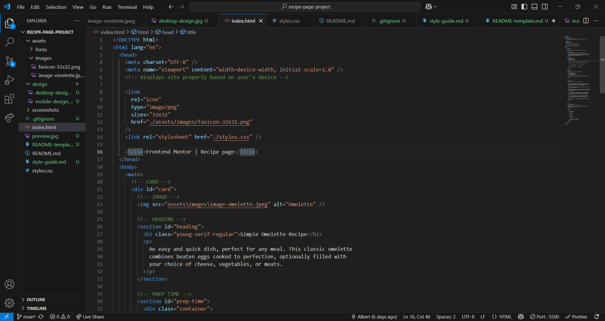
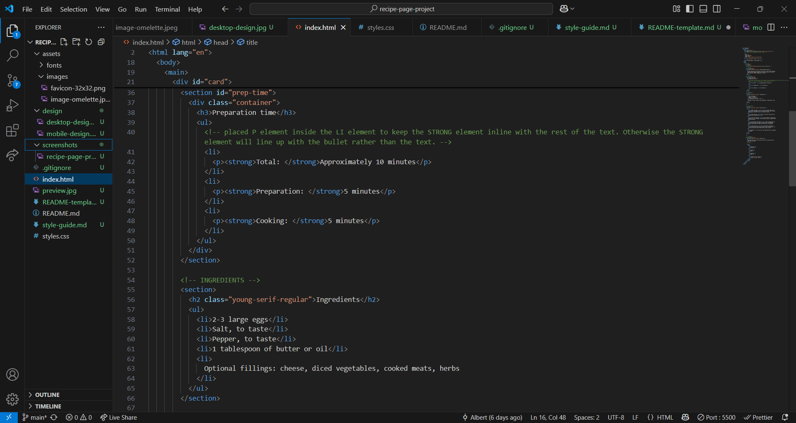

# Frontend Mentor - Recipe page solution

This is a solution to the [Recipe page challenge on Frontend Mentor](https://www.frontendmentor.io/challenges/recipe-page-KiTsR8QQKm). Frontend Mentor challenges help you improve your coding skills by building realistic projects.

## Table of contents

- [Overview](#overview)
  - [The challenge](#the-challenge)
  - [Screenshot](#screenshot)
  - [Links](#links)
- [My process](#my-process)
  - [Built with](#built-with)
  - [What I learned](#what-i-learned)
  - [Continued development](#continued-development)
  - [Useful resources](#useful-resources)
- [Author](#author)
- [Acknowledgments](#acknowledgments)

## Overview

### Screenshot

HTML




CSS


### Links

- Solution URL: [Add solution URL here](https://your-solution-url.com)
- Live Site URL: [Add live site URL here](https://your-live-site-url.com)

## My process

### Built with

- Semantic HTML5 markup
- CSS custom properties
- Flexbox
- Mobile-first workflow

### What I learned

I was having difficulty with lining up the bullet center to all of the text in the LI element. I learned that by wrapping the text inside the LI element within a P element it lined up the bullet center of all the text. Without the P element inside of the LI element the STRONG element was not lining up properly with the rest of the text. Below is the HTML structure for the UL element containing LI elements.

```html
<!-- PREP TIME -->
<section id="prep-time">
  <div class="container">
    <h3>Preparation time</h3>
    <ul>
      <!-- placed P element inside the LI element to keep the STRONG element inline with the rest of the text. Otherwise the STRONG element will line up with the bullet rather than the text. -->
      <li>
        <p><strong>Total: </strong>Approximately 10 minutes</p>
      </li>
      <li>
        <p><strong>Preparation: </strong>5 minutes</p>
      </li>
      <li>
        <p><strong>Cooking: </strong>5 minutes</p>
      </li>
    </ul>
  </div>
</section>
```

I needed to use the "ul li ::before" psuedo code to set up the bullet. For the "ul li" the bullets needed to be removed. "display: flex" and "align-items: center" is the code to center the bullet to the block of text.

```css
ul li {
  align-items: center;
  display: flex;
  list-style: none;
}

ul li::before {
  border: solid 4px black;
  border-radius: 50%;
  content: " ";
  display: block;
  margin-right: 20px;
}
```

### Continued development

I had difficulty with lining up the bullets center of all my text and for my text to display properly. I will be reading more about ordered and unordered lists to get a better at working with them.

I need to read more about tables and get more familiar with them.

### Useful resources

- [FreeCodeCamp](https://www.freecodecamp.org/news/css-media-queries-breakpoints-media-types-standard-resolutions-and-more/) - This helped me to define the screen breakpoints.
- [YouTube - CSS Express](https://www.youtube.com/watch?v=w9gVDgFzPO8) - This video taught me how to vertically center the bullets of the LI element text.
- [Matheus Vinicio](https://matheus-vinicio.github.io/RECIPE/) - I noticed that in this code the individual placed the P element inside of the LI element. It got me to think of wrapping the text that was not displaying properly inside the P element.

## Author

- Website - [Add your name here](https://www.your-site.com)
- Frontend Mentor - [@yourusername](https://www.frontendmentor.io/profile/yourusername)
- Twitter - [@yourusername](https://www.twitter.com/yourusername)

**Note: Delete this note and add/remove/edit lines above based on what links you'd like to share.**

## Acknowledgments

Thank you to freeCodeCamp and Frontend Mentor for teaching me new skills and creating great communities.
